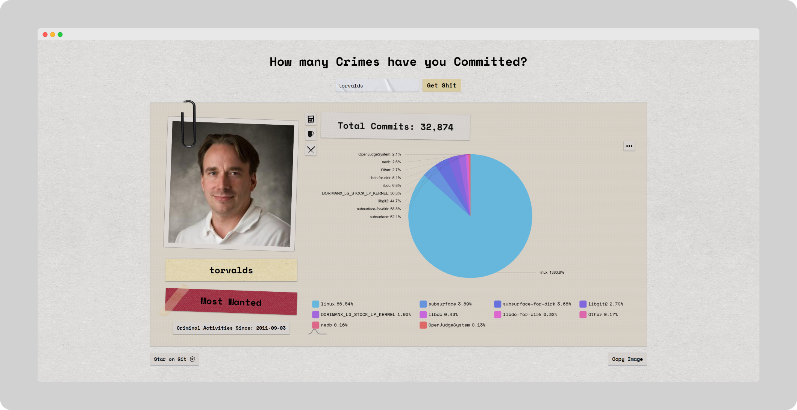
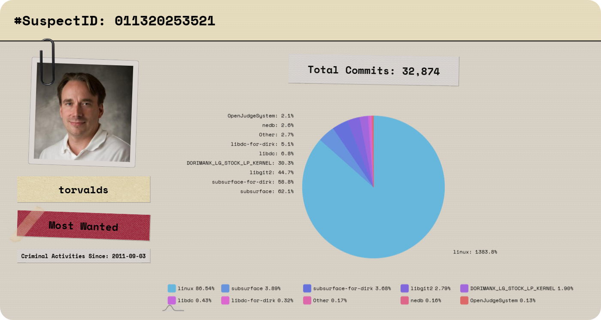
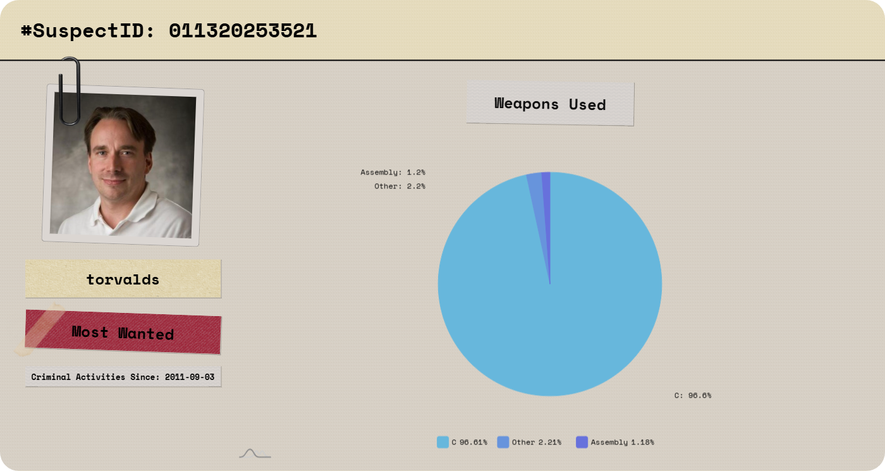

# [How-Many-Crimes-Have-You-Committed](https://praashoo7.github.io/How-Many-Crimes-Have-You-Committed/)

Hey, code criminal! Uncover the dark secrets of your commit history, every crime(line of code) you've committed, every weapon (coding language) you've wielded, and every crime scene (repository) you've defiled. Review your total 'crimes,' track your felonious patterns, and maybe, just maybe, write a line of code that isn't a war crime next time!

  

# Copy the Image and share it on your Socials to raise awareness.

  

## Credits

  - Textures and PNGs from [TransparentTextures](https://www.transparenttextures.com/) & [Freepik.](https://www.freepik.com/)
  - SpaceMono font from Google Fonts.
  - Icons from [SVGRepo.](https://www.svgrepo.com/)
  - Chart from [AMCHARTS.](https://www.amcharts.com/)  

## License

How-Many-Crimes-Have-You-Committed is open-source Software Licensed under the [MIT License](https://github.com/Praashoo7/How-Many-Crimes-Have-You-Committed/blob/main/LICENSE)
